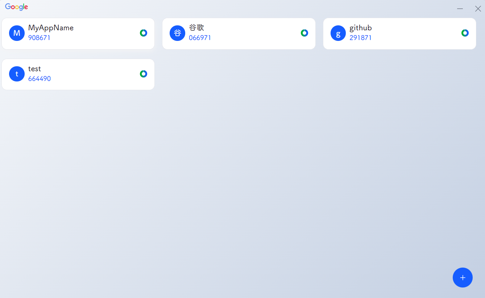
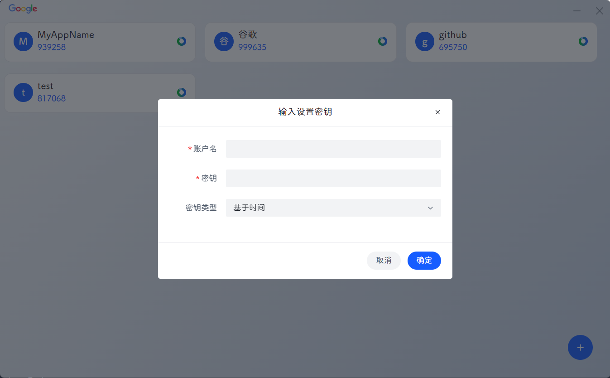

## 谷歌验证器桌面端

###### 由于谷歌验证器未提供桌面端端，所选wails简单封装一个使用。已实现基本功能

| #  | Version  |
| ------------ | ------------ |
| Wails  | v2.9.2  |
| Go  | v1.21.5  |
| Node.js  | v20.13.1|
| npm  | v10.5.2  |

## 安装

构建请查看[wails 文档](https://wails.io/zh-Hans/docs/introduction)

1. 执行 `go install github.com/wailsapp/wails/v2/cmd/wails@latest` 安装 Wails CLI。
2. 执行 `wails build`，即可构建二进制文件

## 运行截图

